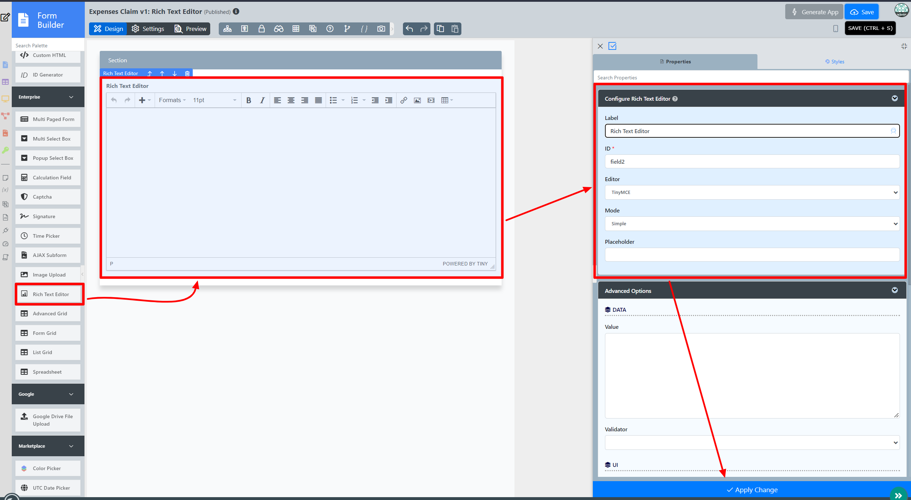

# Description

Rich Text Editor offers the interface for editing the rich text  within web browsers, which presents the user with a "what-you-see-is-what-you-get" (WYSIWYG) editing area.

The Rich Text Editor is only available on Professional and Enterprise  Edition.

